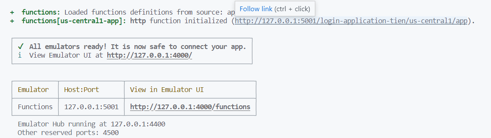

# MY SIMPLE LOGIN APPLICATION - TIEN THANH LE

## The structure of my project
### Frontend

The folder called `client` holds my React frontend application.

I defined three routes which are used to navigate to login page, validate page and not found page.

Futhermore, the `layouts` folder holds "Login Layout" to wrap the login page, validate page. The `pages` folder holds the design of login page, validate page and not found page.

Besides that, in the `components` folder, there is the `GlobalStyles` component which holds some common styles in the whole website.

### Backend and Database
The folder called `functions` holds the backend API endpoints which are used to make requests from the frontend application.

In the `utils` folder, I made some initialization to take use of firebase firestone database and exported it to use from everywhere in the project.

The `controllers` folder holds some functions defined to process the request and response to the frontend. Besides that, the `auth.js` file in the root of the `functions` folder uses express router to define endpoints.

## How to run it
> Due to the trial account from firebase and twilio, I have some notices:
> * We have to change some code lines to run the project.
> * Due to the free twilio phone number, the message contains access code may not be sent globally. In this case, there is an access code printed in the terminal screen (From Git Bash run the backend API) in order to illustrate the process.

1. Open Git Bash in the root of the project.
    - Run the command `cd functions`.
    - Then run the command `npm run serve` to run the backend API. 
    - When the terminal screen look like this, copy the link in line pointed by cursor.
    - 
    - Open `axiosConfig.js` in the `src` folder in the `client` folder and paste the link in `baseURL` like the following code.
    ```javascript
    import axios from 'axios'

    export const axiosInstance = axios.create({
        baseURL: 'http://127.0.0.1:5001/login-application-tien/us-central1/app/',
    })
    ```

2. Create a '.env' in the root of the `functions` folder and paste the your TWILIO ACCOUNT SID and TWILIO AUTH TOKEN.

3. Open `auth.js` in the `controllers` folder in the `functions` folder.
    - Paste your twilio phone number in the property "from" in the line 59.

4. Open other Git Bash in the root of the project.
    - Run the command `cd client`.
    - Then run the command `npm start` to run the frontend application. 